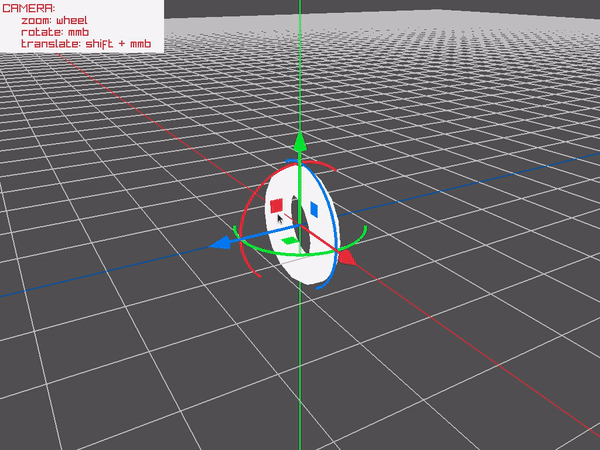

# RAYGIZMO
`raygizmo` was designed as an auxiliar module for [raylib](https://github.com/raysan5/raylib) to create simple interactive gizmo gadget to perform basic object transformation (rotation and translation).




*NOTE: raygizmo is a single-file header-only library (despite its internal dependency on raylib), so, functions definition AND implementation reside in the same file `raygizmo.h`, when including `raygizmo.h` in a module, `RAYGIZMO_IMPLEMENTATION` must be previously defined to include the implementation part of `raygizmo.h` BUT only in one compilation unit, other modules could also include `raygizmo.h` but `RAYGIZMO_IMPLEMENTATION` must not be defined again.*

*NOTE: Current raygizmo implementation is intended to work with [raylib-5.0](https://github.com/raysan5/raylib/releases/tag/5.0) and PLATFORM_DESKTOP*


## Example
In a simplest case gizmo can be used like this:
```c
// Draw the model here:
BeginMode3D(camera);
    DrawModel(model, ...);
EndMode3D();

// Immediately update and draw gizmo
Vector3 position = {
    model.transform.m12, model.transform.m13, model.transform.m14};
Matrix transform = UpdateGizmo(camera, position);

// Apply gizmo-produced transformation to the model
model.transform = MatrixMultiply(model.transform, transform);
```


Interactive example could be built and run like this:
```bash
cd examples \
&& gcc -o ./gizmo ./gizmo.c -lraylib -lm -lpthread -ldl \
&& ./gizmo
```
